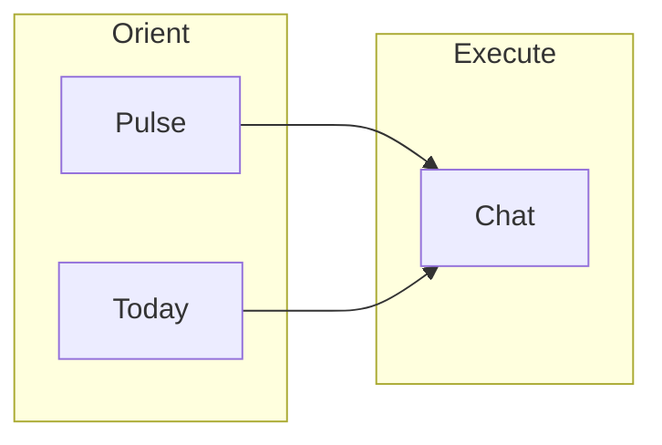
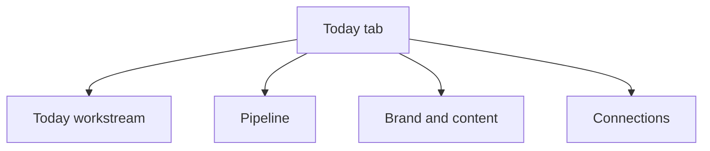
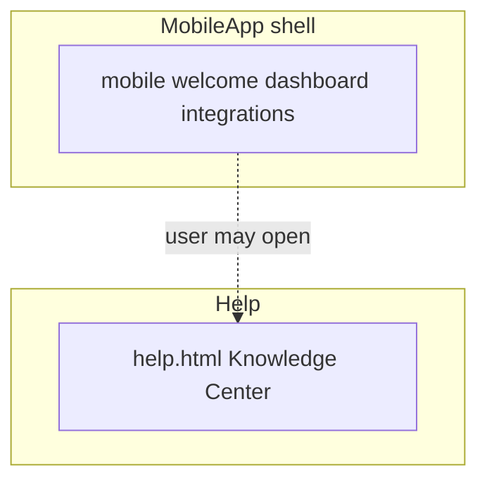
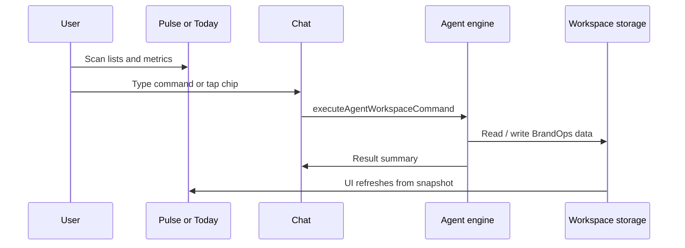
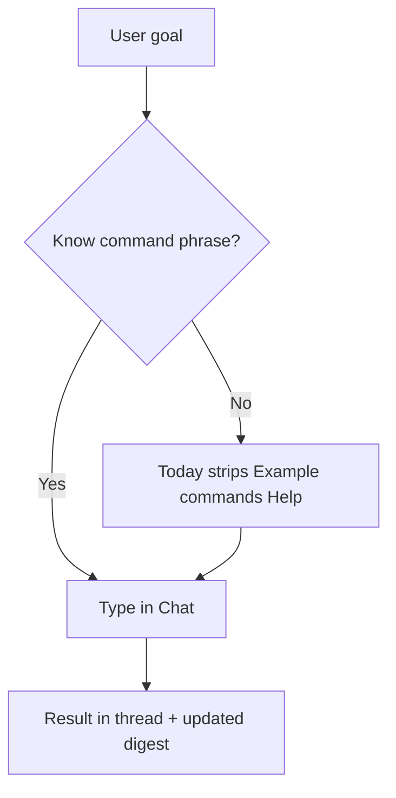
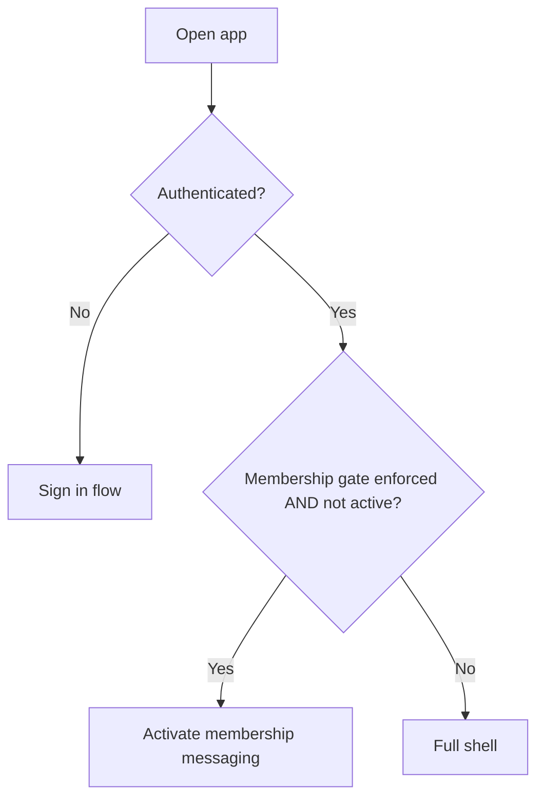

# BrandOps user experience (UX map)

A single, graphic-friendly reference for how users move through the product, what each surface is for, and how tasks connect to the command system. Use this for onboarding copy, research briefs, and prompt-pack design.

**Related code:** `src/pages/mobile/mobileApp.tsx`, `src/services/agent/intent/commandIntent.ts`, `docs/cockpit-command-surface-map.md`, `APPLICATION_WIRING_STATUS.md`.

---

## 1. One-sentence model

**Users read state on Pulse and Today, then act by running natural-language commands in Chat** (or via chips and “Open in Chat” that feed the same engine). Settings holds trust, export, and advanced controls; Integrations tab focuses on connection health and quick-add command shortcuts.



---

## 2. The shell (what users see)

### 2.1 Five-tab bar (primary navigation)

Order is fixed: **Pulse → Chat → Today → Integrations → Settings**.

```text
┌────────────────────────────────────────────────────────────┐
│  BrandOps  (context / chrome as implemented)                 │
├────────────────────────────────────────────────────────────┤
│                     MAIN CONTENT AREA                        │
│              (active tab: Pulse | Chat | Today | …)            │
├────────────────────────────────────────────────────────────┤
│  [ Pulse ] [ Chat ] [ Today ] [ Integrations ] [ Settings ]   │
└────────────────────────────────────────────────────────────┘
```

### 2.2 Tab purpose (in-product copy contract)

| Tab              | Role in one line                                                                          |
| ---------------- | ----------------------------------------------------------------------------------------- |
| **Pulse**        | What is due next — mixed timeline; open a row in **Chat** to act.                         |
| **Chat**         | Command surface — run commands, read replies, use **Example commands**.                   |
| **Today**        | Cockpit — digest by **workstream** (Today, Pipeline, Brand & content, **Connections**).   |
| **Integrations** | What is connected — sources, provider status, **Quick add**; custom work in **Chat**.     |
| **Settings**     | Account & workspace; **Advanced** for readouts, audit, export, **local product metrics**. |

Full strings live in `src/pages/mobile/shellSectionCopy.ts` (`SHELL_SECTION_COPY`).

**Local success metrics (roadmap §2).** Open **Settings → Advanced → Local product metrics** to see on-device aggregates: habit (active days), see→act (navigations to Chat from each tab), command confidence (ok/fail, success rate, timing), and shell-ready / command round-trip latency (rolling medians and ~p95). Storage key `product-usage-v1`; never sent to a server. Details: `docs/PRODUCT_EXPERIENCE_ROADMAP.md`, `src/services/usage/localProductUsage.ts`, `LocalProductUsageReadout.tsx`.

### 2.3 Today = four workstreams (second-level nav, single-active tab group)

On the **Today** tab, users switch **work areas** with horizontal icon pills. Only the **active** work area is visible at a time — this is a real tab group, not a scroll anchor, so the screen never dumps four long sections at once. URL `?section=` still deep-links to the same blocks; inactive panels remain in the DOM (behind `hidden`) so screen readers and routing contracts keep working.



| Workstream          | User goal                                                           |
| ------------------- | ------------------------------------------------------------------- |
| **Today**           | Mission map, scheduler pulse, peeks.                                |
| **Pipeline**        | Deals, outreach, follow-ups, pipeline health.                       |
| **Brand & content** | Library, publishing queue, brand vault preview.                     |
| **Connections**     | Integrations summary, links to full Integrations; command starters. |

---

## 3. Other pages (not the five-tab shell)

| Page                    | What it is                                                                          |
| ----------------------- | ----------------------------------------------------------------------------------- |
| **`index.html`**        | Redirects to `mobile.html`.                                                         |
| **`welcome.html`**      | Same `MobileApp` shell; often lands on **Today** first.                             |
| **`dashboard.html`**    | Same shell; may **redirect** to `mobile.html` for section parity.                   |
| **`integrations.html`** | Same shell; Chrome extension **options** entry; default tab often **Integrations**. |
| **`help.html`**         | **Knowledge Center** — manual and topics, **not** the five-tab app.                 |
| **OAuth / privacy**     | Callbacks and legal — peripheral.                                                   |



**Naming distinction:** **Integrations tab** = inside `mobile.html?section=integrations`. **Integrations page** = `integrations.html` (extension options / same UI, different entry). Footer links label both so users are not confused.

---

## 4. The default user loop (scan → act → verify)



**Verify:** Replies show in the **Chat** thread; Pulse/Today **refresh** from the same workspace snapshot so counts and peeks update after commands succeed.

---

## 5. How users complete “any task” (conceptual)

Practical path:

1. **Find the domain** — Pulse (time-ordered) or Today (workstream: pipeline, brand, etc.).
2. **Choose an affordance** — “Open in Chat”, **Quick commands** strip, or go to Chat and type.
3. **Use vocabulary the engine understands** — deterministic routes (e.g. `create follow up`, `pipeline health`, `configure: ...`). See `src/services/agent/intent/commandIntent.ts` and `docs/cockpit-command-surface-map.md`.
4. **Disambiguate in Chat** if needed — some shortcuts apply to the **first matching** entity in engine order; naming the entity in a command reduces mistakes.



---

## 6. URL and deep links (`?section=`)

| `section` (examples)                                | Effect                                                |
| --------------------------------------------------- | ----------------------------------------------------- |
| `pulse`, `timeline`                                 | Pulse tab                                             |
| `chat`                                              | Chat tab                                              |
| `daily`, `cockpit`                                  | Today tab, workstream defaults toward **Today** block |
| `today`, `pipeline`, `brand-content`, `connections` | **Today** tab + scroll/highlight that workstream      |
| `integrations`                                      | Integrations tab                                      |
| `settings`                                          | Settings tab                                          |

Parsing: `src/pages/mobile/mobileShellQuery.ts`.

---

## 7. Launch and trust (when access is blocked)

- **Sign-in gate** — until authenticated (unless preview/ungated dev flows are enabled), the app steers to sign-in.
- **Membership gate** — **off by default** in builds. If `VITE_ENFORCE_MEMBERSHIP_GATE=1` is set at build time, users without **active** membership are limited (Settings remains available for account flows). See `src/shared/account/launchLifecycleGate.ts` and `README.md` (Launch UX Gates).



---

## 8. Command routes ↔ UI (summary)

The cockpit doc maps every **CommandRoute** to the **workstream** and **UI** (strip / chip / Chat). Mutations go through the **same** executor whether the user types in Chat or taps a control that calls `runCommand` / `sendQuickCommand`.

| Area         | Example intent      | Example phrase patterns                                    |
| ------------ | ------------------- | ---------------------------------------------------------- |
| Time & tasks | follow-ups, notes   | `create follow up`, `complete follow up`, `add note:`      |
| Pipeline     | deals, outreach     | `pipeline health`, `update opportunity`, `draft outreach:` |
| Brand        | content, publishing | `add content`, `draft post:`, `reschedule` + publishing    |
| Connections  | sources, infra      | `connect` / `add source`, `add artifact`, `add ssh`        |
| Workspace    | cadence, prefs      | `configure:` … (also Settings)                             |

**Authoritative tables:** `docs/cockpit-command-surface-map.md`.

---

## 9. UX principles implied by the implementation

- **Read/write separation** — Big grids are mostly **digest**; “CRM UI” is not a second spreadsheet app.
- **One execution pipeline** — Chat and quick actions share **one** command path for trust and audit.
- **Explicit Integrations naming** — Tab vs extension **page** is labeled in nav to avoid double destinations that feel the same.
- **Help is a manual** — Not a second copy of the shell; it explains surfaces and command vocabulary.

---

## 10. Suggested use for “Professor Byte” and prompt packs

- **System prompts** should assume **tab + workstream** when guiding navigation (“On Today → Pipeline, use … or type in Chat …”).
- **User prompts** should **not** promise drag-and-drop deal boards or non-chat editing unless the product adds those surfaces.
- **Safety prompts** should mention **first-row / default** behavior when a shortcut could affect the wrong record unless the user names it.
- **Gating copy** should mention sign-in; membership only if `VITE_ENFORCE_MEMBERSHIP_GATE` is used in that environment.

---

## 11. Document history

- **Location:** repository root; standalone so stakeholders can read without opening the plan or wiring docs first.
- **Source of truth for behavior:** `mobileApp`, `commandIntent`, `agentWorkspaceEngine`, and files referenced above.
