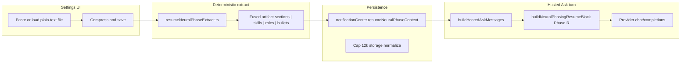

# Résumé → AI: structure, naming, and scorecard

This doc aligns **what you asked for** (resume capture + models that understand the operator) with **what the repo actually implements today**, so roadmap and expectations stay honest.

---

## 1. Naming — avoid mixing three different things

| Term (casual) | What it is in this codebase | Transformer in the ML sense? |
|---------------|----------------------------|------------------------------|
| **“Neural phasing” / Phase R** | Deterministic plain-text résumé → compact **fused artifact** → stored in workspace → appended to **hosted Ask** system prompt (`buildNeuralPhasingResumeBlock`). | **No.** Rule-based extraction + prompt grounding; the **hosted LLM** you configure is whatever provider/model you choose (may be Transformer-based on their side). |
| **Native / offline “AI”** | Toy **segment-attention MLP** + fusion blobs + optional **structured JSON** (`nativeStructuredArtifacts`, `nativeResumeArtifacts`). Used from CLI/scripts and exports; not the same code path as Ask Phase R in the extension UI. | **No.** Small MLP, not a Transformer stack. |
| **Vision: “Transformer AI working on behalf of users”** | Autonomous capture, embedding/RAG, proactive actions, fine-tuned identity model, etc. | **Not built as one productized system yet** — pieces below are partial foundations. |

---

## 2. Build structure (what exists)

### 2a. Hosted Ask — Phase R (extension / mobile shell)

Résumé grounding only affects answers when the user runs **`ask: …`** through the **OpenAI-compatible bridge** (configured endpoint + API key).

| Layer | Location | Role |
|-------|----------|------|
| Extract (TS) | `src/services/ai/resumeNeuralPhaseExtract.ts` | Mirror of `scripts/lib/nativeResumeArtifacts.mjs` fused output; **keep in sync** when rules change. |
| Prompt block | `src/services/ai/neuralPhasing.ts` | Phase R markdown + precedence rules (Brand / global role wins over résumé if conflict). |
| Injection point | `src/services/ai/hostedAskTurn.ts` | Phase R after global baseline; whole system string capped (~28k chars). |
| Schema | `src/types/domain.ts` | `NotificationCenterSettings.resumeNeuralPhaseContext` |
| Normalize | `src/services/storage/storage.ts` | Trim + max length |
| UI | `MobileSettingsAISurface.tsx` (`SettingsResumeNeuralPhasePanel`) | Paste → compress → save / clear |
| Snapshot | `buildWorkspaceSnapshot.ts`, `mobileSettingsReadout.ts` | Previews for diagnostics |

### 2b. Native artifact rail (offline / export / toy MLP)

Parallel path for **workspace export**, **CLI**, and **native model** probes — not automatically synced from `resumeNeuralPhaseContext` unless you wire export/import flows.

| Layer | Location |
|-------|----------|
| Resume fused + JSON facets | `scripts/lib/nativeResumeArtifacts.mjs` (`extractResumeArtifacts`, `extractResumeArtifactRecord`) |
| Full structured package | `scripts/lib/nativeStructuredArtifacts.mjs` |
| Train / run | `scripts/train-native-model.mjs`, `scripts/run-native-model.mjs` |

See **`ARTIFACT_PIPELINE_PLAN.md`** for fusion vs JSON graph detail.

---

## 3. Scorecard (rolling)

Score **1–5** where **5** = “matches full autonomous Transformer vision” and **3** = “solid MVP grounding.”

| Capability | Score | Notes |
|------------|------:|-------|
| **Capture résumé in product UI** | **5** | Paste + **plain-text file** (≤192 KB) + Assistant shortcut → Settings Phase R; deep link `mobile.html?section=settings#settings-resume-neural-phase`. |
| **Persist operator grounding** | **5** | Workspace field + normalization + full JSON export. |
| **Use grounding in hosted Ask** | **5** | Phase R in system prompt; tested in `hostedAskTurn.test.ts`. |
| **Semantic understanding (embeddings / fine-tune)** | **1** | Not implemented (Tier C). |
| **Autonomous “on behalf of user” behavior** | **2** | Copilot JSON automation exists; not résumé-driven background loops. |
| **Parity: Phase R artifact ↔ native fusion blob** | **5** | `extractNativeProfileFromWorkspaceExport` merges `resumeNeuralPhaseContext`; `run-native-model.mjs` uses merged fuse in traces / `--structured-json`. |
| **Privacy / precedence clarity** | **5** | Privacy policy + Knowledge Center + Phase R precedence string in prompt. |

**Net:** Tier **A–B** complete for MVP + CLI parity. Tier **C** (retrieval / delegate autonomy) remains future work.

---

## 4. Tier status

| Tier | Scope | Status |
|------|--------|--------|
| **A** | Assistant link to Phase R, URL hash opens Unified workspace + scroll, plain-text file load, privacy/help disclosure | **Done** |
| **B** | Native export profile + `run-native-model` consume stored Phase R; `--structured-json` wiring fixed | **Done** |
| **C** | Embeddings, RAG into Ask, fine-tune, proactive delegate policies | **Not implemented** |

---

_Update this scorecard when tiers ship; Phase R content version lives beside Getting started (`GETTING_STARTED_CONTENT_VERSION`) — résumé pipeline versioning can follow git + CHANGELOG or bump extraction only when `nativeResumeArtifacts.mjs` rules change._
